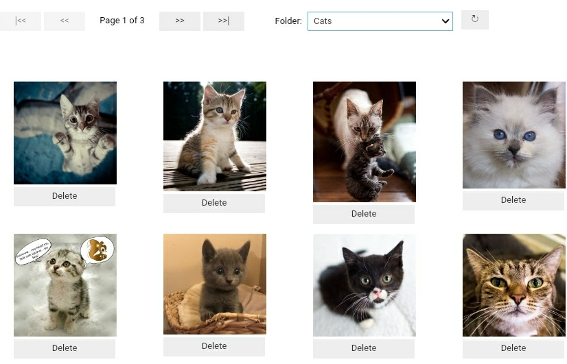

# jmd_imagescraper
> An image scraping library for creating deep learning datasets.


This library is for creating deep learning datasets. 

It uses DuckDuckGo for the image scraping as they return nice big images and have some rather nice parameters to make your life easier, for example we can filter the searches to only return square images which are photos.

`jmd_imagescraper.core` contains the main scraping/downloading functionality.

`jmd_imagescraper.imagecleaner` contains an image cleaner you can use from within your notebook to clean up the results and delete anything unsuitable.

## Install

`pip install jmd_imagescraper`

## How to use

```
from jmd_imagescraper.core import * # dont't worry, it's designed to work with import *
from pathlib import Path

root = Path().cwd()/"images"

duckduckgo_search(root, "Cats", "cute kittens", max_results=20)
```

```
from jmd_imagescraper.imagecleaner import *

display_image_cleaner(root)
```



## Docs

If you're reading this on pypi.org you can find the docs at https://joedockrill.github.io/jmd_imagescraper/

## History

```
20/09/2020 add: PR from @butchland, add uuid to filenames, fix for users of fastai.vision.widgets.ImageClassifierCleaner
18/09/2020 rel: version 1 released as pypi package

```
